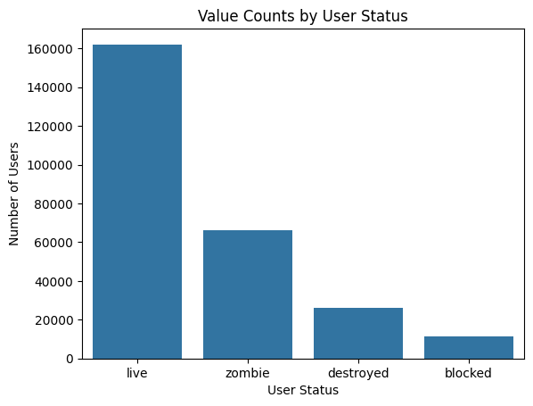
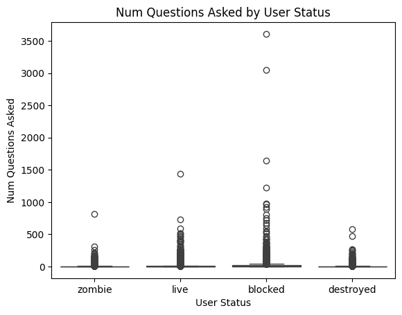
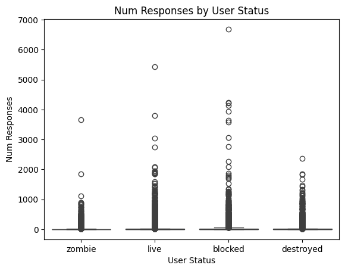
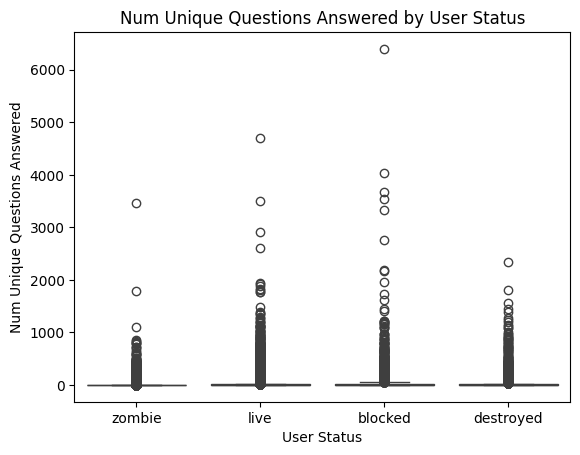
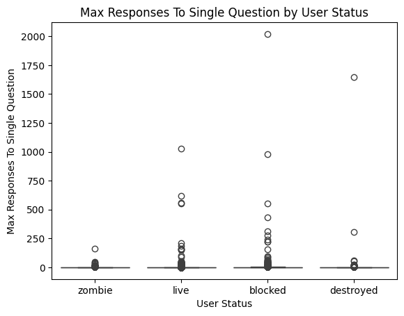
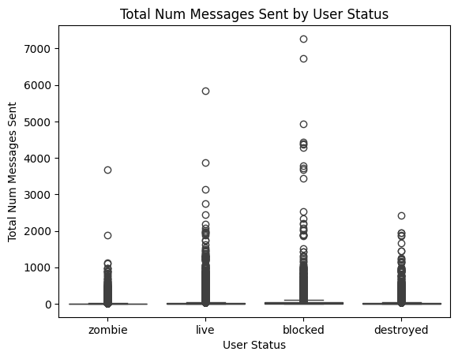
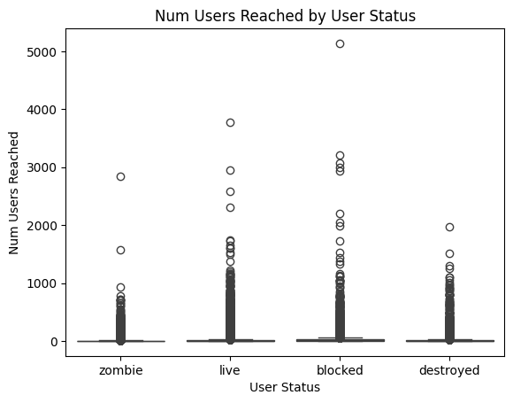

# Analysis of User Status and Outliers in Relationship to Leadership Definition

## Goal

The goal of this analysis is to investigate the characteristics of blocked users and outliers, and compare characteristics across the four user status categories (live, zombie, blocked, and destroyed). This is relevant in relation to the definition of leaders vs. non-leaders in the WeFarm network. Many potential characteristics of leaders may overlap with the characteristics of users who may be using the platform in ways it was not intended. For example, a large number of responses could indicate leadership, or it could indicate spam. This analysis aims to tease out specific flags which could be considered when determining leadership definitions.

## Analysis Process

### Sample Size

Due to the size of the dataset, this analysis was completed on a subset of data representing all questions from Uganda in the English language. This can be replicated with the entire dataset or a different subset by swapping in a different csv file with the same columns as the original WeFarm dataset.

The current analysis includes

- 4,464,980 rows of data,
- representing 265,388 individual users, and
- 3,497,774 unique question-response pairings.

## Data Preparation and Exploration

A summary dataframe was created to organize data by user_id, and data was aggregated by individual user.

Summary statistics were generated by grouping individual users by user_status.

Boxplots were generated to examine the distribution of each variable, prior to addressing outliers.

Finally, outliers were identified and removed using the 1.5 IQR approach.

Manual spot checking was used to evaluate the question and response content of removed users to evaluate the results of the 1.5 IQR removal approach, and to generate future questions.

## Visualizations and Key Insights

### Value Counts by User Type

Overall, only a small number of users are blocked. The data does not include any information on when or why the user was blocked.

### Distributions by User Type

Overall, the box plots show that there are large numbers of high outliers across multiple characteristics and all user_status categories. Blocked users tend to be more active users in terms of asking questions and answering questions.

### Eliminating Outliers Using the 1.5 IQR approach has Pros and Cons

Spot Checking question and response content was used to evaluate the strategy of removing outliers using the 1.5 IQR approach. The content examples studied revealed a few insights worthy of further study:

- The 1.5 IQR approach seems to eliminate some users who have strong leadership potential ( active, with relevant interactions). A more nuanced threshold should be considered based on each characteristic. Perhaps leaders are defined as outliers in certain characteristics.
- There are instances of blocked users who were very active with relevant content, and could be considered as leaders, then started engaging in inappropriate irrelevant conversations (for example, of a sexual nature), and then blocked.
- There are instances of active users sharing their phone number to continue a conversation outside of the WeFarm network/platform. Some instances of this seem related to farming content, and some are releted to inappropriate content.

## Questions For Further Inquiry

1. What is the impact of sharing phone numbers and taking conversations out of WeFarm? How might this relate to leadership definition?

- Analyze activity of users who share phone numbers in response content
- Survey or interview users to determine impact of personal interactions that started from WeFarm interactions
- Should these personal interactions be encouraged or discouraged based on how they impact the rest of the network?

2. What more can be done to keep networks like WeFarm safe for users (especially in relation to sexual content)?

- There are very few users with gender data, but this subset could be explored for trends
- What happens to user activity after they experience inappropriate responses to questions?
- Could sentiment analysis by used to track relevance or appropriateness of content over time, and compare with user activity metrics?

## Use of AI

ChatGPT was used as a reference on general coding and syntax questions. All AI content was human-checked and tested.
