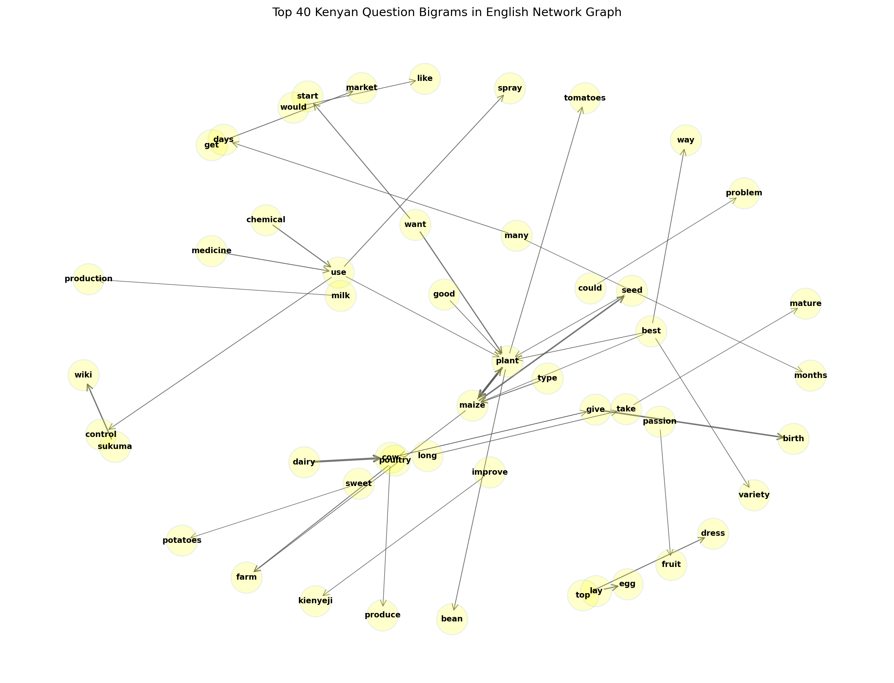
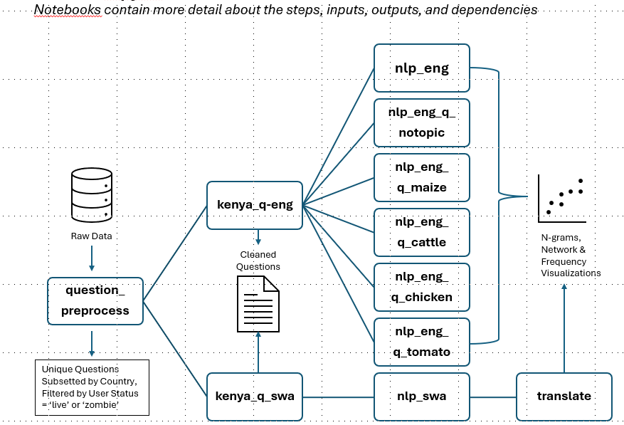

## Beatrice Liu: Challenge 4 - Crop Questions Analysis 

## Overview
Conducted word frequency analysis on questions by **Kenyan Farmers** in the Producers Direct Dataset of WeFarm SMS; created interactive and static visualizations of top bi-, tri-, and quad-grams on top 5 topics -  cattle, tomato, maize, chickens, none -  to identify patterns and relationships and communicate insights concisely. Note:  I can't figure out how to display the interactive graphs here; they are saved in the network_graphs folder.

See *'farmers.bliu.pdf'* for summary of findings

## Research Question
- What insights can be gleaned from Crop-specific and Crop-Independent Questions?  


## Methodology: *detailed explanations in the Jupyter Notebooks*

### Data Sources
- Producers Direct Dataset of WeFarm SMS
- Swahili [stopword](https://data.mendeley.com/datasets/mmf4hnsm2n/1) and [verb conjugation](https://data.mendeley.com/datasets/rvt89578g5/1) files  

### Approach: *Notebook overviews describe steps in greater detail* 
1. Data loading and initial exploration
2. Data cleaning and preprocessing
3. Data segmentation into smaller datasets for analyses: unique questions asked by farmers in 4 countries
4. Filtered dataset for questions by Kenyan farmers
5. Natural Language Processing - remove punctuation marks, convert to lowercase, tokenize using custom list of stopwords and lemma dictionaries
6. Count word occurances in list of words created in Step 5
7. Generate list of tuples for more frequent words for visualization and interpretation


### Output Files and Visualizations
- Cleaned data files and interactive visualizations can be found in [google drive folder](https://drive.google.com/drive/folders/1tpwqTqoFfZCWvDvncJjaSbzzua0Y6Q_i?usp=sharing)
- Note:  visualizations are uploaded to github in 'network_graphs' folder
- N-gram frequency graphs can be found in individual notebooks *(the PNG files cropped out the n-gram text)*


### Tools and Technologies
- **Programming Language**: Python 3.13.5 
- **Key Libraries**: pandas, numpy, matplotlib, nltk, deep-language... - full list is in the notebooks
- **GenAI Tools Used**: ChatGPT, Anaconda Toolbox
- **Other Tools**: Jupyter Notebook


### Tools Used
- **ChatGPT**: Used for generating code for natural language processing functions in English, translating Swahili tokens into English
- **Anaconda Toolbox**: Used for generating interactive network graphs

### Human Review Process
- All AI-generated code was reviewed and tested for accuracy
- Modified AI suggestions in the following ways: fixed a surprising number of coding errors


## Key Findings: *Refer to 'farmers.bliu.pdf'*


### Finding: Translating from Swahili is a **major** roadblock
- Swahili is an under-resourced language in Natural Language Processing
- Commonly used Python packages such as SpaCy, NLTK, or Gensim do not have inherent Swahili support
- It is an agglutinative language:  prefixes, roots, and suffixes are combined into one word.  It also has complex noun class structures, that affect verb agreement.  These can lead to ineffective lemmatization.
- Accurate translations require an agricultural corpus on rural farming in Africa, and custom lists of words and lemma dictionary.   


### Additional Findings:  *Refer to 'farmers.bliu.pdf'*
- With These Challenges, Swahili Trigrams Translated in English – All Topics –  Were More Informative Than Bi- or Quadgrams
- Tri-grams of English Questions Without a Topic Still Focused on Farming:  e.g. Best Practices on Birthing Calves, Planting Maize and Starting a Poultry Farm
- Cattle Farmers in Kenya Focused on Giving Birth, Milk Production, and Health
- Chicken Farmers in Kenya Asked About Young Chicks, Laying Eggs, and Medicines
- Maize Farmers in Kenya Asked About the Best Fertilizer and Weed Control, Best Seeds and Planting
- Tomato Farmers in Kenya Asked About Planting, Best Seeds, and Keeping Tomatoes Disease-Free


## Static Network Visualizations: *see file list below for interactive graphs* 





## Limitations and Challenges

### Data Limitations
- Missing data issues:  gender, country-level location, nothing more granular
- Data quality concerns: vague data dictionary
- Translations:  These African languages are linguistically complex, with unique syntax, idioms, and dialectal variations that are region-specific  

### Methodological Limitations
- Assumptions made: *'blocked'* and *'destroyed'* user statuses were dropped from analysis
- Impractical to call GoogleTranslate to translate the full text of > 2 mm questions:  extracted and translated most frequent word combination in the questions
  
### Technical Challenges
- Translation accuracy issues - **YES** *see above*

### References
1. Bernard Masua, Noel Masasi, "Enhancing text pre-processing for Swahili language: Datasets for common Swahili stop-words, slangs and typos with equivalent proper words",
Data in Brief, Volume 33, 2020, 106517, ISSN 2352-3409, https://doi.org/10.1016/j.dib.2020.106517
2. Mathayo, Irene; Kondoro, Alfred Malengo (2025), “Swahili Verb Conjugation Dataset: A Comprehensive Analysis of Agglutination and Verb Structure Across Tenses and Persons”, Mendeley Data, V3, doi: 10.17632/rvt89578g5.3
3. Bernard Masua, Noel Masasi, "In the heart of Swahili: An exploration of data collection methods and corpus curation for natural language processing", Data in Brief,Volume 55,2024,110751,ISSN 2352-3409,https://doi.org/10.1016/j.dib.2024.110751

  
## Files in This Contribution

```
Bliu_analysis/
├── README.md (this file)
├── notebooks/
│   ├── question_preprocess.ipynb
│   └── kenya_q_swa.ipynb
│       └──nlp_swa.ipynb
│       └──translate.ipynb
│   ├── kenya_q_eng.ipynb
│       └──nlp_eng.ipynb
│       └──nlp_eng_q_notopic.ipynb
│       └──nlp_eng_cattle.ipynb
│       └──nlp_eng_chicken.ipynb
│       └──nlp_eng_maize.ipynb
│       └──nlp_eng_tomato.ipynb
├── 10 directed interactive network visualizations/
│   ├── {xx}bigram_eng_ken_{topic}_network.html
│── static directed network visualizations/
│   └── top40trigrams_ken_eng_network.png
│   └── top40bigrams_ken_eng_network.png
│   └── top40bigrams_ken_eng_Notopic_network.png
│   └── top30trigrams_ken_eng_network.png
├── results - displayed in notebooks /
│   ├── farmers.bliu.pdf - sorry, no markdown file
└── translated n-grams from swahili to english data/ 
    └── ken_240quadgrams_swa2eng.txt
    └── ken_500bigrams_swa2eng.txt
    └── ken_500trigrams_swa2eng.txt
```

### How to Run This Analysis -- *I have no clue, worked in Jupyter Notebook*


## Open and run notebooks in order:


```


**Author**: [Beatrice Liu]
**GitHub**: @bl1412
 

---

**Last Updated**: [12/8/25]
